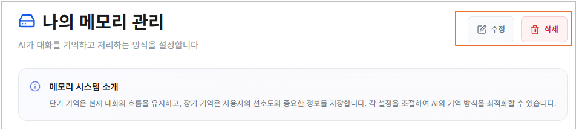

# 2.2.6 시나리오

플로우 차트로 에이전트를 결합해 시나리오를 생성하고, 채팅을 확인하며, 시나리오 목록을 조회·수정할 수 있습니다.

<figure><figcaption></figcaption></figure>

1. **선택 옵션**: 템플릿 탭에서는 모든 시나리오가 조회되며, MY 시나리오 탭에서는 자신이 생성한 시나리오가 조회됩니다.

* 템플릿: 모든 사용자가 생성한 시나리오가 출력됩니다. **\[템플릿 사용]** 버튼을 클릭하면 MY 시나리오로 추가할 수 있습니다.
* MY 시나리오: 자신이 시나리오를 생성하거나 템플릿을 가져온 경우 해당 목록이 조회됩니다.

2. **검색 옵션**:  시나리오 이름을 입력하면, 해당 조건에 부합하는 목록이 조회됩니다.
3. **새 시나리오 만들기**: 새로운 시나리오의 템플릿을 직접 생성할 수 있습니다.
4. **시나리오 목록**: 선택 옵션에 따라 시나리오 목록이 조회됩니다.

* MY 시나리오 목록에서는 사용 중인 에이전트, 모델, 도구 개수를 확인할 수 있습니다.

## **시나리오 생성하기**

1. 상단의 **\[새 시나리오 생성]** 버튼을 클릭합니다.
2. 나타나는 화면에서 시나리오 이름, 설명을 입력한 후 카테고리를 선택한 다음, **\[시나리오 생성]** 버튼을 클릭합니다.

<figure><figcaption></figcaption></figure>

3. 워크플로우 화면이 표시되며, 시작(주황색) 노드에서 하단의 \[에이전트 가져오기] 버튼을 클릭합니다.&#x20;

<figure><figcaption></figcaption></figure>

4. 에이전트 생성이나 가져오기를 통해 에이전트를 워크플로우에 추가할 수 있습니다.

<figure><figcaption></figcaption></figure>

5. 추가된 에이전트는 시작 노드와 답변 노드에 연결합니다.


참고사항:

* 노드 간 연결은 점 표시를 누른 상태에서 드래그하여 진행합니다.
* Input은 시작 노드에서 다른 에이전트로 연결해야 하며, Output은 다른 에이전트의 Input으로 연결되거나 답변 노드로 연결되어야 합니다.
* 연결된 선을 끊고 싶을 경우, 선을 클릭한 뒤 빨간색 \[X] 버튼을 클릭합니다.


<figure><figcaption></figcaption></figure>

6. 필요에 따라 에이전트의 모델, 서브모델, 페르소나, 도구 등을 편집할 수 있습니다.&#x20;

* 변경 및 선택하기를 클릭한 후 선택 창이 나타나면, 서비스를 선택한 뒤 **\[확인]** 버튼을 클릭합니다.


**주의:** 자신이 보유하지 않은 모델, 페르소나, 도구 등이 포함된 에이전트는 미선택 상태로 추가됩니다.

* 따라서, 에이전트 템플릿에서 미보유 서비스를 확인한 뒤, 각 메뉴에서 자신의 서비스로 추가해야 합니다.


<figure><figcaption></figcaption></figure>

7. 답변노드에서는 하단의 **\[실행]** 버튼을 클릭하면 프롬프트 화면 페이지로 이동합니다.


참고:  API 키를 생성하여 권한과 만료일을 설정한 후, 하단의 \[API 키 생성] 버튼을 통해 키를 발급할 수 있습니다.


<figure><figcaption></figcaption></figure>

8. 워크플로우 구성이 완료되면 상단 바에서 **\[수동 저장]** 버튼을 클릭합니다.

* 자동 저장을 ON으로 전환하면 워크플로우가 실시간으로 저장됩니다.

<figure><figcaption></figcaption></figure>

9. 저장된 템플릿은 \[MY 시나리오] 탭에서 생성된 것을 확인할 수 있습니다.

<figure><figcaption></figcaption></figure>

***

## **에이전트 생성**

1. 시작(주황색) 노드 하단에서 **\[에이전트 가져오기]** 버튼을 클릭합니다.

<figure><figcaption></figcaption></figure>

2. 나타나는 화면에서 **\[에이전트 생성]** 버튼을 클릭합니다.

<figure><figcaption></figcaption></figure>

3. 에이전트의 이름을 입력한 후 하단의 **\[생성]** 버튼을 클릭합니다.

<figure><figcaption></figcaption></figure>

4. 생성된 에이전트 노드에서 모델, 서브모델, 페르소나, 도구 등을 선택합니다.


**주의:** 자신이 보유한 모델, 서브모델, 페르소나, 도구에 한해서 선택할 수 있습니다.

* 서비스 추가의 경우, 각 메뉴에서 자신의 서비스로 추가해야 합니다.


<figure><figcaption></figcaption></figure>

5. 에이전트 설정이 완료되면 노드 간 연결을 진행합니다.

<figure><figcaption></figcaption></figure>

6. 워크플로우 구성이 완료되면 상단 바에서 **\[수동 저장]** 버튼을 클릭합니다.

<figure><figcaption></figcaption></figure>

7. 저장이 완료되면 \[AI 에이전트] 메뉴의 **\[MY 에이전트]**&#xC5D0;서 해당템플릿이 생성된 것을 확인할 수 있습니다.

<figure><figcaption></figcaption></figure>

***

## **시나리오 채팅하기**

1. MY 시나리오에서 템플릿 우측 상단의 **\[채팅하기]** 버튼을 클릭합니다.


**참고**:  시나리오 내 워크플로우 화면에서는 답변 노드의 **\[실행]** 버튼을 클릭하면 채팅 페이지로 이동합니다.&#x20;


<figure><figcaption></figcaption></figure>

2. 프롬프트 화면이 나타나면, 원하는 내용을 채팅창에 입력한 후 엔터 키를 누르거나 비행기 아이콘을 클릭합니다.


**기본 검색:** 단일 응답으로 빠른 답변을 제공합니다.

**Deep 에이전트 모드:** 에이전트 간 양방향 통신을 지원하여 복합적인 협업 기반의 답변을 제공합니다.

**이미지 첨부:** '사진모양'을 클릭하면 이미지를 첨부할 수 있습니다.


<figure><figcaption></figcaption></figure>

3. 프롬프트의 질문에 따른 응답이 출력됩니다.&#x20;

* 하단의 채팅 세부 내역을 통해 대화 통계와 사용 토큰을 확인할 수 있습니다.


**주의:** 검색을 할 경우 토큰이 사용됩니다.


<figure><figcaption></figcaption></figure>

4. 신규 채팅을 원할 경우, 좌측의 \[대화 생성] 버튼을 클릭하면 새 대화 화면에서 질문할 수 있습니다.


참고: 대화 내역은 좌측 목록에 나열됩니다.


<figure><figcaption></figcaption></figure>

5. 대화 내역에서 항목을 클릭하면 \[연필 모양] 클릭 시 제목을 수정할 수 있으며, \[휴지통 모양] 클릭 시 대화가 삭제됩니다.

<figure><figcaption></figcaption></figure>

***

## **MY 시나리오 템플릿 추가**

1. 전체 시나리오에서 원하는 항목의 **\[템플릿 사용]** 버튼을 클릭합니다.

<figure><figcaption></figcaption></figure>

2. 나타나는 화면에서 워크플로우 확인 후 우측 상단의 **\[나의 시나리오 추가하기]** 버튼을 클릭합니다.


**참고:** 다른 템플릿에서 제작된 에이전트의 경우 복사본이 생성됩니다.

**주의**:  자신이 보유하지 않은 모델, 페르소나, 도구 등이 포함된 에이전트는 미선택 상태로 추가됩니다.

* 따라서, 에이전트 템플릿에서 미보유 서비스를 확인한 뒤, 각 메뉴에서 자신의 서비스로 추가해야 합니다.


<figure><figcaption></figcaption></figure>

3. \[MY 시나리오] 탭을 클릭하면, 정상적으로 시나리오가 생성된 것을 확인할 수 있습니다.


**참고**: MY 시나리오에 생성된 시나리오는 편집 및 수정이 가능합니다.


<figure><figcaption></figcaption></figure>

